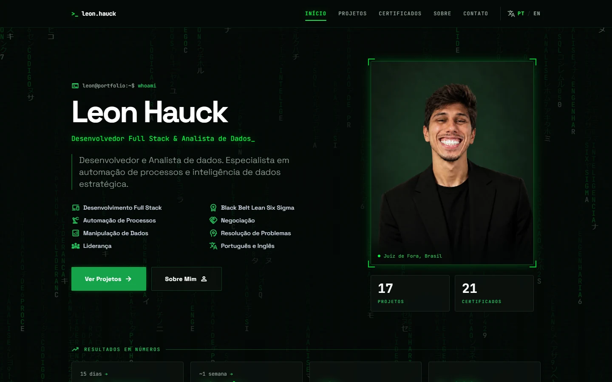
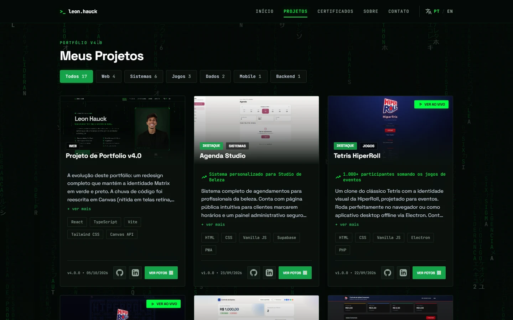
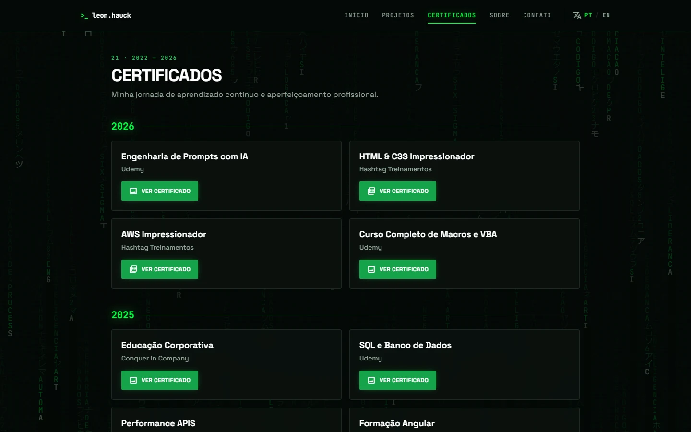
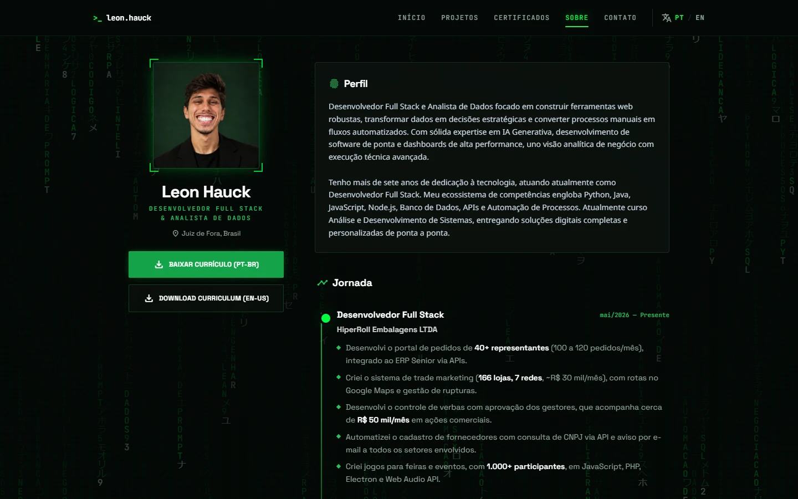
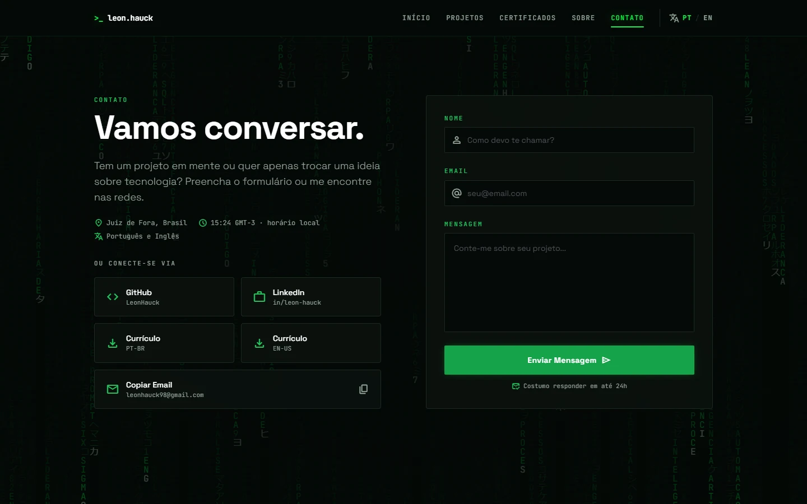
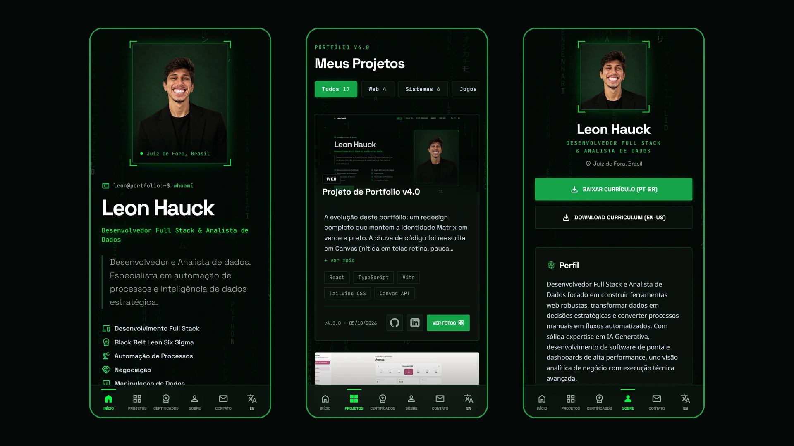

<div align="center">

# `>_` Leon Hauck — Portfólio

**Desenvolvedor Full Stack & Analista de Dados**

Meu hub de projetos, certificações e trajetória profissional — com tema Matrix, em verde e preto.

<a href="https://portfolio-leonhauck-dev.netlify.app/">
  
</a>

<br><br>


<br><br>

<a href="https://portfolio-leonhauck-dev.netlify.app/">
  
</a>

</div>

---

## 🟢 Sobre o projeto

Este é o meu cartão de visitas digital: um único lugar que reúne meus projetos de software (Web, Mobile, Backend e Dados), minhas certificações e minha jornada profissional.

A identidade visual é inspirada em Matrix. A chuva de código ao fundo não é decorativa por acaso — as palavras que caem são as tecnologias e competências com que trabalho (`PYTHON`, `SQL`, `SIX SIGMA`, `AUTOMAÇÃO DE PROCESSOS`...).

O site está disponível em **português e inglês**, com troca de idioma em um clique.

---

## 🖥️ Telas

<table>
  <tr>
    <td width="50%"></td>
    <td width="50%"></td>
  </tr>
  <tr>
    <td align="center"><b>Projetos</b> — filtro por categoria e galeria de imagens</td>
    <td align="center"><b>Certificados</b> — agrupados por ano</td>
  </tr>
  <tr>
    <td width="50%"></td>
    <td width="50%"></td>
  </tr>
  <tr>
    <td align="center"><b>Sobre</b> — perfil, jornada e currículo</td>
    <td align="center"><b>Contato</b> — formulário e redes</td>
  </tr>
</table>

<div align="center">
  
  <br>
  <b>No celular</b> — navegação na barra inferior
</div>

---

## ⚡ Funcionalidades

| | |
|---|---|
| 🌧️ **Matrix rain** | Animação em Canvas com as minhas tecnologias. Nítida em telas retina, pausa quando a aba está oculta e respeita a preferência de movimento reduzido do sistema. |
| 🌍 **Dois idiomas** | Português e inglês. Cada projeto e certificado é cadastrado uma única vez e aparece nos dois. |
| 📱 **Responsivo** | Duas colunas e menu no topo no desktop; coluna única e barra inferior no celular. |
| 📈 **Resultados** | Números reais do meu trabalho em destaque na Home, na Jornada e nos cards dos projetos. |
| 🗂️ **Projetos** | Mais recentes primeiro, filtro por categoria, botão "Ver ao vivo" e galeria com imagens e vídeo navegável pelo teclado (`←` `→` `Esc`). |
| 🎓 **Certificados** | Agrupados por ano automaticamente, com link para o certificado e, quando existe, para o projeto final. |
| ✉️ **Contato** | Formulário que envia direto para o meu e-mail, além de GitHub, LinkedIn e cópia do e-mail em um clique. |

---

## 🧰 Tecnologias

      

- **React 19 + TypeScript** — interface em componentes, com tipagem.
- **Vite 6** — servidor de desenvolvimento e build de produção.
- **Tailwind CSS 3** — estilos compilados no build (cerca de 8 KB de CSS no ar).
- **React Router** — navegação entre as páginas sem recarregar.
- **Canvas API** — a matrix rain, sem bibliotecas externas.
- **Material Symbols** — ícones.

---

## 📁 Onde fica cada coisa

```
├── data/
│   ├── projects.ts        ← lista de projetos (é aqui que se adiciona um novo)
│   ├── certificates.ts    ← lista de certificados (é aqui que se adiciona um novo)
│   └── index.ts           traduz, formata datas e ordena — não precisa mexer
├── translations.ts        textos fixos do site em pt e en (menu, bio, jornada, palavras da matrix)
├── pages/                 Home, Projects, Certifications, About, Contact
├── components/            Navbar, MatrixBackground, PhotoFrame, LanguageContext
├── public/assets/         imagens, vídeos, PDFs e currículos
├── index.css              estilos base e classes reutilizáveis (.panel, .btn-primary, .chip...)
└── tailwind.config.js     cores, fontes e animações do tema
```

---

## ➕ Como adicionar projetos e certificados

Cada item é cadastrado **uma única vez** e aparece em português e inglês. Não é preciso mexer em nenhuma página: contadores, filtros, ordenação e agrupamento por ano se atualizam sozinhos.

### Novo projeto

1. Coloque as imagens em `public/assets/` (prefira `.webp` ou `.jpg`, até ~300 KB cada).
2. Abra [`data/projects.ts`](data/projects.ts), copie o primeiro bloco `{ ... }` e cole no **topo** da lista, trocando os dados:

```ts
{
    title: { pt: 'Nome do Projeto', en: 'Project Name' },
    category: 'web',                       // 'web' | 'systems' | 'games' | 'data' | 'backend' | 'mobile' | 'design'
    description: {
        pt: 'O que o projeto faz.',
        en: 'What the project does.',
    },
    tech: ['React', 'TypeScript'],
    imageUrl: '/assets/meu-projeto.webp',  // capa do card
    isFeatured: false,                     // true mostra o selo "Destaque" (use em poucos)
    impact: { pt: '166 lojas · 7 redes', en: '166 stores · 7 retail chains' },  // opcional: resultado em número, em verde no card
    liveUrl: 'https://meu-projeto.com.br', // opcional: mostra o botão "Ver ao vivo"
    version: 'v1.0.0',
    updatedAt: '2026-10-05',               // sempre AAAA-MM-DD
    githubUrl: 'https://github.com/LeonHauck/meu-projeto',
    linkedinUrl: 'https://www.linkedin.com/in/leon-hauck/',
    gallery: [                             // opcional; aceita imagens e .mp4
        '/assets/meu-projeto.webp',
        '/assets/meu-projeto-2.webp',
    ],
},
```

- Se um texto for igual nos dois idiomas, escreva direto: `title: 'Meu Projeto'`.
- A data é formatada sozinha em cada idioma (`05/10/2026` em pt, `10/05/2026` em en) e define a ordem: o mais recente aparece primeiro.
- Para criar uma **categoria nova**, adicione uma linha em `projects.categories` no [`translations.ts`](translations.ts), nos blocos `pt` e `en`.

### Novo certificado

1. Coloque o arquivo (imagem ou PDF) em `public/assets/`.
2. Abra [`data/certificates.ts`](data/certificates.ts), copie o primeiro bloco e cole no **topo** da lista:

```ts
{
    title: { pt: 'Nome do Curso', en: 'Course Name' },
    institution: 'Instituição',
    year: 2026,
    link: '/assets/Certificado Nome do Curso.jpg',
    projectLink: '/assets/Projeto Final.pdf',   // opcional: mostra o botão "Ver Projeto"
},
```

- **Virada de ano:** não é preciso criar nada. Ao cadastrar o primeiro certificado com `year: 2027`, a seção "2027" aparece sozinha no topo da página.
- O ícone de PDF ou de imagem é escolhido pela extensão do arquivo.

### Outros textos

Bio, jornada profissional, os "resultados em números" da Home, menu e as palavras da matrix rain ficam em [`translations.ts`](translations.ts), uma vez em `pt` e uma em `en`. Na jornada, o trecho entre `**dois asteriscos**` aparece em negrito.

A faixa de tecnologias da Home fica na lista `techStack`, em [`pages/Home.tsx`](pages/Home.tsx).

---

## ⚙️ Como executar localmente

Pré-requisito: **Node.js 20 ou superior**.

```bash
git clone https://github.com/LeonHauck/Leon-Hauck-Portfolio.git
cd Leon-Hauck-Portfolio
npm install
npm run dev
```

O site abre em `http://localhost:3000`.

Antes de publicar, confira se compila sem erros:

```bash
npm run build
```

---

## 📈 Evolução

<table>
  <tr>
    <td width="50%"></td>
    <td width="50%"></td>
  </tr>
  <tr>
    <td align="center"><b>v3.0</b> — janeiro de 2026</td>
    <td align="center"><b>v4.0</b> — outubro de 2026</td>
  </tr>
</table>

O que mudou na v4.0: layout próprio para desktop, matrix rain reescrita, foto de perfil corrigida, resultados em números na Home e na Jornada, botão "Ver ao vivo" nos projetos publicados, Tailwind compilado no build, cadastro único de projetos e certificados para os dois idiomas, e arquivos de mídia comprimidos (de 232 MB para cerca de 21 MB).

---

## 👨‍💻 Autor

<div align="left">
  <strong>Leon Hauck</strong> <br>
  <em>Desenvolvedor Full Stack e Analista de Dados</em>
</div>
<br>

<div align="left">
  <a href="https://www.linkedin.com/in/leon-hauck/" target="_blank">
    
  </a>
  <a href="https://github.com/LeonHauck" target="_blank">
    
  </a>
  <a href="mailto:leonhauck98@gmail.com" target="_blank">
    
  </a>
  <a href="https://portfolio-leonhauck-dev.netlify.app/" target="_blank">
    
  </a>
</div>

---
<p align="center">Construído com dedicação e focado em eficiência técnica.</p>
